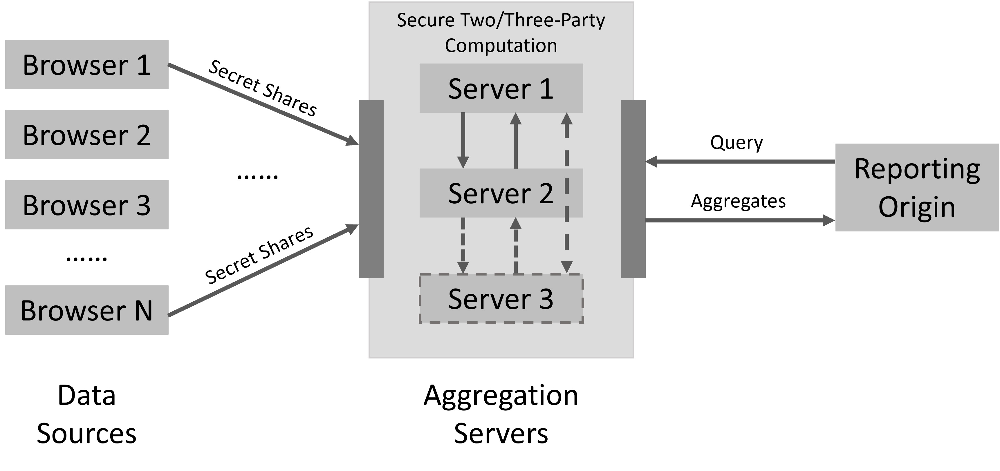
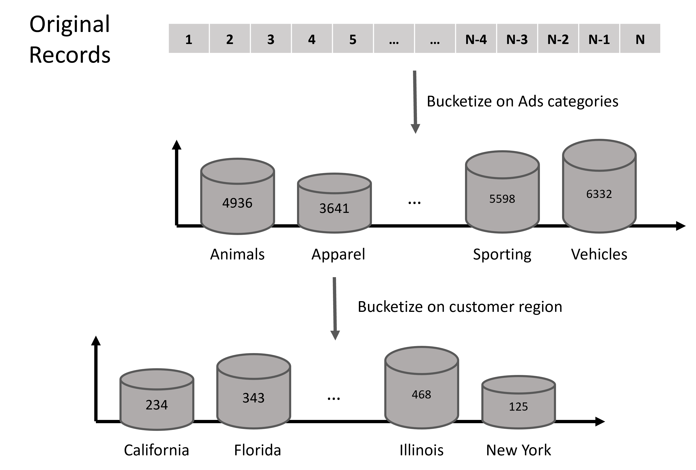
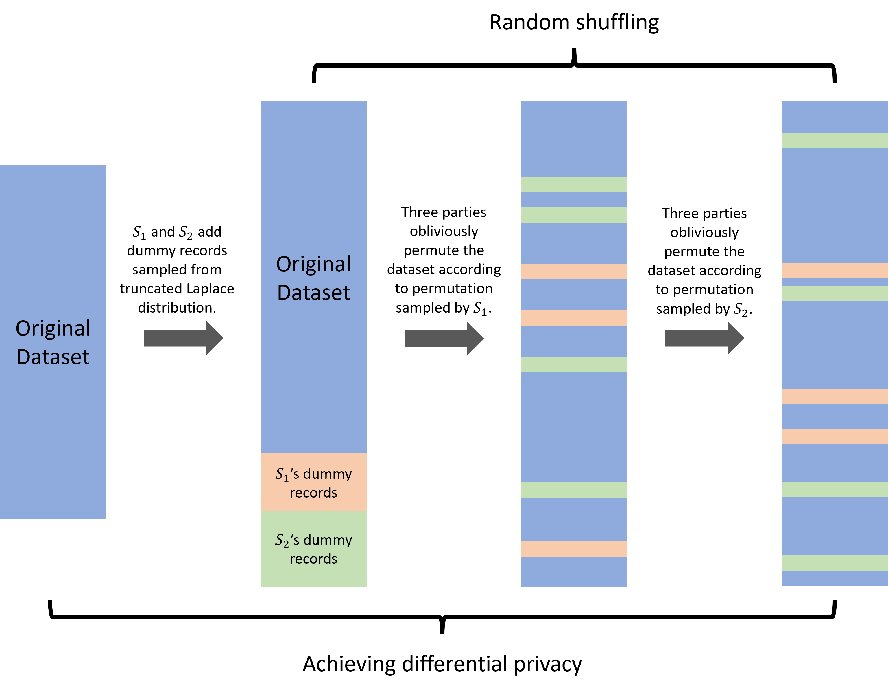
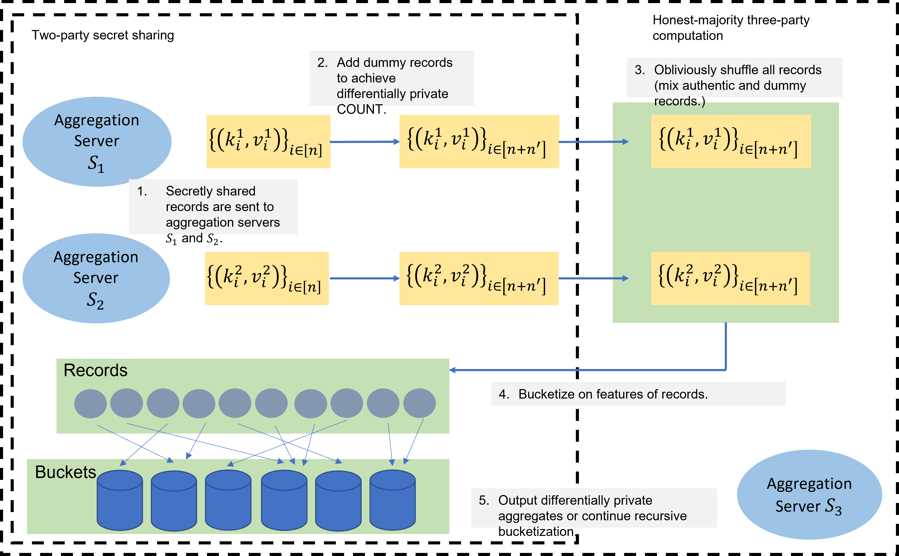

# Secure Multi-Party Aggregation
Secure aggregation can be realized by a cryptographic primitive called secure
multi-party computation (MPC). In this document, we propose an efficient
protocol which allows multiple parties to jointly generate a differentially
private multi-dimensional histogram from data records collected from distributed
data resources, without learning anything about individual records.

- [Secure Multi-Party Aggregation](#secure-multi-party-aggregation)
    - [Performance Preview](#performance-preview)
  - [Overview](#overview)
    - [Third-Party Cookies](#third-party-cookies)
    - [System](#system)
    - [High-Level Idea](#high-level-idea)
  - [Background](#background)
    - [Threat model](#threat-model)
    - [Two-Party Secret Sharing](#two-party-secret-sharing)
    - [Secret shared shuffling](#secret-shared-shuffling)
    - [Differential Privacy](#differential-privacy)
  - [Our proposal](#our-proposal)
    - [Achieving differential privacy](#achieving-differential-privacy)
    - [Full protocol](#full-protocol)
    - [Honest-Majority Three-Party Shuffling](#honest-majority-three-party-shuffling)
      - [Input](#input)
      - [Protocol Execution](#protocol-execution)
      - [Output](#output)
      - [Re-share](#re-share)
  - [Extensions](#extensions)
    - [Computing SUMs](#computing-sums)

### Performance Preview
Our aggregation protocol is based on an MPC protocol for **oblivious
bucketization**. We did performance evaluation using a prototype implementation
run on a laptop with Intel Core i7-8665 CPU of frequency 1.90 GHz, and 48 GB
RAM. The prototype uses only one thread and runs in local network, so it can be
thought of as capturing the computational cost of the protocol. The dataset
consists of **10 million** records; they are bucketized into 1024 histogram
cells. The records either contain 128-bit keys or 1024-bit keys.

Operations|128-bit key|1024-bit key
------|------|-----
Differentially private histogram|1.9 s|7 s

## Overview
In this section, we describe the motivation, system design and high-level ideas
of our secure aggregation protocol. The cryptographic backgrounds and protocol
details are deferred to following sections.

### Third-Party Cookies
Existing uses of third party cookies has raised a lot of privacy concerns. A
website $A_1$ that a user is visiting installs a third-party cookie belonging to
the website $B$. Then website $B$ would be able to track the user's activities
and provide personalized web service based on the identifier and device ID
stored in the cookie when the user is browsing websites $A_2,A_3...,A_n$. For
example, an advertiser is able to analyze users' habits based on their browser
histories and then publish advertisements that the users might be interested in.

Currently, there is very little control over who collects this data or how it
can be used. Due to this concern, various browsers have started to limit how
and when sites can set third-party cookies and/or when they can be accessed. The
entire browser industry is on a path toward deprecating the ability for sites to
set state that is passively available across sites; the [Privacy CG's Storage
Partitioning](https://github.com/privacycg/storage-partitioning) Work Item
provides a high-level summary of the changes envisioned across various parts of
the web platform.

However, there is no denying that there is a huge need for cross-site data
collection and analysis. A large number of business models such as targeted
advertising rely heavily on the third-party cookies. An ideal solution is to
provide a new paradigm which protects individual users' privacy while allowing
data analysis in aggregate.

In this work, we propose a privacy-preserving protocol based on secure
multi-party computation and differential privacy which allows some legitimate
entities to analyze data collected from many users' browsers. They only receive
statistical aggregation results generated from many users' data  instead of
directly accessing the information collected from individual users.

### System
The system design is shown below. If follows several other proposals for similar
goals such as [The Prio
System](https://www.usenix.org/system/files/conference/nsdi17/nsdi17-corrigan-gibbs.pdf),
[Google's Attribution Reporting
API](https://github.com/WICG/conversion-measurement-api) and [Microsoft's
PARAKEET](https://github.com/WICG/privacy-preserving-ads/blob/main/Parakeet.md).

1. The data are collected from Internet users; the browsers are viewed as
   distributed data resources, or data owners. The single unit of the data from
   a browser is viewed as a *record*.  We assume each record is composed of a
   *key*, which is a list of bitstrings representing features that will be used
   to segment the data in aggregation queries, and a list of *values*, which are
   quantities to be aggregated.  So, for example, if a record is generated based
   on an ad conversion, the first 10 bits of the key might represent the Ad
   Campaign ID, while the first of the values might represent the dollar amount
   of the conversion.

2. The records are **secret-shared** and sent to multiple aggregation servers.
   (Or, as in the [Multi-Browser Aggregation Service
   proposal](https://github.com/WICG/conversion-measurement-api/blob/main/SERVICE.md),
   each share may be encrypted for one of the aggregation servers and then sent
   to the reporting origin, who will be responsible for sending the encrypted
   shares to the appropriate aggregation servers.) Each share of the record
   does not reveal any information about the content of this record.

3. The aggregation servers are run by different non-colluding entities. In the
   real world, they are held by independent companies or organizations and they
   are restricted by laws, regulations or contracts to not share data with
   each other. Upon receiving the queries from legitimate data consumer (the
   reporting origin), the aggregation servers instantiate secure two-party
   computation or secure three-party computation to jointly compute aggregates
   on users' records and output the results.

4. The reporting origins are data consumers. They are allowed to receive
   aggregates for further analysis, but not to directly access users' records.
   They make queries to the aggregation servers with pre-determined query
   structure. The number of queries they can make on a given set of records is
   restricted by the privacy budgets for differential privacy.

### High-Level Idea
In our scheme, we are mainly targeting histogram/COUNT aggregation. We can
potentially also support SUM queries, although this requires some addition work
as we will describe [below](#computing-sums) - for now we will focus on simple
COUNTs. The query processing is realized by **oblivious bucketization**. A
histogram can be naturally viewed as having multiple buckets, each corresponding
to a different choice that could be assigned to one of the features encoded in
the user record keys.  To generate histograms, the records are put into
different buckets according to the encoded features, thus called bucketization.
We can generate a multi-dimensional histogram by recursively bucketizing on
different features.

To ensure user privacy, we need to hide (from the reporting origin and
aggregation servers) which bucket a given record ends up in and exactly how many
records end up in each bucket.  This will allow us to prove that the only
information revealed to the reporting origin or aggregation servers is
differentially private.

## Background
In this section, we describe some important building blocks of our secure
aggregation protocol, secure multi-party computation
(MPC) protocols and differential privacy. They provide oblivious
computations and privacy protection during the aggregation.

### Threat model
For our protocol we will use 3 aggregation servers, and assume that they will
all follow the protocol (in cryptographic terminology that they are honest but
curious), and that they will not share the data they receive with one another.
We do however, allow for one of the aggregation servers to share data with the
reporting origin, as might occur e.g. in the case where the reporting origin and
aggregation server are owned by the same entity.  Using 3 rather than 2
aggregation servers allows us to design more efficient protocols.

### Two-Party Secret Sharing
We use the additive 2-out-of-2 secret-sharing in our protocol.  Let $x$ be an
element in an algebraic structure such as group or ring known by the browser.
(For example, $x$ is an integer between $0$ and $MAX$. Alternatively, $x$ could
be a bitstring in $\{0,1\}^\ell$ .) To share $x$ to aggregation servers $S_1$
and $S_2$, the browser first samples a random element $x_1=r$ in the same
algebraic structure and computes $x_2=x+r$.  Here the addition '$+$' generally
represent the addition in these special algebraic structures.  (In our examples,
this would mean computing $x_2=x+r$ mod $MAX$ or computing $x_2 = x$ XOR $r$
respectively.) The browser then sends $x_1$ privately (e.g. over TLS) to server
$S_1$ and $x_2$ privately to server $S_2$. The randomness $r$ prevents $x_1$ or
$x_2$ from leaking any information about $x$.

### Secret shared shuffling
A key part of our approach will be a protocol to shuffle and reshare the
records.  In this protocol, two aggregation servers each have shares of each of
a list of records.  With the help of a third aggregation server they will each
obtain a new list of shares such that
1. Combining these shares would regenerate the original list of records just in
   a different order.
2. None of the aggregation servers can determine, for any given input record,
   where in the shuffled list it appears.

Our protocol is roughly based on the honest-majority three-party oblivious
permutation described in [MohRinRos20](https://eprint.iacr.org/2019/518.pdf).
The details are described [below](#honest-majority-three-party-shuffling).

### Differential Privacy
The differentially private aggregation in our setting prevents the reporting
origin or aggregation servers from gaining any information about any individual
user's record. The traditional approach to providing DP for histograms is to use
the Laplace mechanism, which essentially adds random noise sampled from a
Laplace distribution to the count for each bucket.  In our case, this noise will
be implemented by adding dummy records to each bucket, which means we need a
variation on this approach in which we only add positive noise.  We use the
approach based on [DP with constraints](https://arxiv.org/pdf/2007.01181.pdf)
described
[here](https://github.com/WICG/conversion-measurement-api/blob/6e542ccc8664a3e8870188e3ff13cb0780347a6a/private_histograms_mpc.md#intermediate-dp-analysis)

Another option is to have the user's browser add noise when the record is
generated, using techniques from local differential privacy.  However, adding
noise during aggregation (i.e. global DP) can provide much better privacy vs.
accuracy tradeoffs.  Intuitively this is because the local approach requires
each record to contain enough noise on its own to provide privacy; when these
records are combined this noise adds up.  When we add noise at the aggregation
step we can add noise once, the amount of noise is independent of the number of
records combined, and that noise will provide privacy for each of the users.
This is why we choose to focus on the latter approach.

## Our proposal
### Achieving differential privacy
*Differential privacy:* The only thing each of the servers learns is the number
of records in each bucket.  Since we have added an appropriately sampled number
of dummy records to each bucket, this will be equivalent to revealing a
differentially private histogram.

The key idea behind our protocol is as follows:
1. Two of the aggregation servers (call them $S_1$ and $S_2$) will each hold a
   list with one secret of each user's record.

2. Each of these two aggregation servers will add some dummy records for each
   bucket. The number of noise records are drawn from truncated Laplace
   distribution referenced above.  Each of the dummy records will have the
   relevant key bits set appropriately for the corresponding bucket. Each server
   will then secret share its dummy records and send the second share to the
   other aggregation server.  Both of servers append these dummy record shares
   to the end of their share lists.

3. With the help of the 3rd aggregation server, $S_1$ and $S_2$ will perform a
   secret shared shuffle as a result of which they obtain shares of the permuted
   records, including the dummy records.  Note that it is now impossible for any
   of the parties to tell which records correspond to dummy records vs real
   records, or where any of the original real records ended up in the list.
   Pictorially, this looks like the below diagram:
   

4. Now the parties can reveal the relevant bits from the resulting records,
   reconstruct the bits that determines which bucket each record should be
   placed in, and produce a list of shares for each of the buckets that
   contains all the records that belong in that bucket plus some small number
   of dummy records.

This process will allow the aggregation to compute a differentially private
bucketization.  If they then wish to subdivide one of the buckets, they would
then repeat this process using only the records in that bucket.

### Full protocol
The protocol is briefly described in the following figure. The basic protocol
achieves differential private histogram generation.

The bucketization process put records in buckets according to some bits encoded
in keys. For example, a feature of an ad campaign could be encoded in $t=10$
bits of the keys, which points each record to one of $2^{t}=1024$ buckets.

The protocol starts with secret-sharing of the information from browsers. The
browser $B_i$ generates a record $\{k_i,v_i\}$ and its two secret shares
$\{k_i^1,v_i^1\}$ and $\{k_i^2,v_i^2\}$. It sends the shares to the appropriate
aggregation servers. (Alternatively, the browser can encrypt the shares and pass
them through the reporting origin as described [above](#system).)

The reporting origin chooses a set of shares to aggregate and a set of bit
positions to bucketize on.

The next step is to achieve *differential privacy* by mixing dummy records in
the dataset. For each bucket $B_i$, $S_1$ and $S_2$ each independently sample
noise $y_i^1$ and $y_i^2$ from truncated and discretized Laplace distribution
with expectation of $s$ and domain $[0,2s]$, where $s$ is a parameter that
depends on the desired DP privacy budget $\epsilon$. For $j\in \{1,2\}$, $S_j$
generates $y_i^j$ dummy records belonging the bucket $B_i$. Then they will
secret share these dummy records, and append them at the end of the dataset.
At this moment, the dataset consists of $n$ authentic records and $n'$ dummy
records.

Now the third party $S_3$ comes into the game for the *random shuffling*. Among
$S_1$, $S_2$ and $S_3$, each pair of them jointly sample a random permutation,
namely, $\pi_{12},\pi_{13},\pi_{23}$.  (This can be easily done using a
pseudorandom generator if each pair of servers shares a secret key initially.
If not, one of each pair of parties can generate this seed and send it to the
other.) They will execute an honest-majority three-party permutation protocol to
permute the dataset with these permutations, as described
[below](#honest-majority-three-party-shuffling). For an input record array $A$,
it inputs the secret shares of $A$ and output secret shares of
$\pi_{23}(\pi_{13}(\pi_{12}(A)))$. This step has 2 goals:
1. Mix the authentic records and dummy records, so the adversaries won't get an
   exact histogram COUNT after the bucketization.
2. Mix the input records so it is not clear which is finally placed in which
   bucket.

The basic protocol ends with two aggregation servers $S_1$ and $S_2$ revealing
the $t$-bit feature encoded in the key to reconstruct the feature and determine
which bucket the item belongs in. Then they locally put the shares of records
into one of $2^t$ buckets. The histogram for COUNT is direct.

At this point the parties can decide to subdivide one or more of these buckets
based on another feature, by running this protocol again, or to compute the SUM
of one of more values for one or more of these buckets. (See discussion
[below](#computing-sums))

### Honest-Majority Three-Party Shuffling
Assume there are three parties $S_1,S_2,S_3$ and they do not collude with each
other (do not share their secrets or transcripts of the protocol to others).
Initially $S_1$ and $S_2$ have secret shares of the array of records $A$; we
refer to their respective arrays of shares as by $A_1$ and $A_2$. Assume there's
a pseudorandom generator $PRG(\cdot):\{0,1\}^\lambda \rightarrow \{0,1\}^*$
which inputs a seed and outputs a pseudorandom string.  

We will also assume that each pair of parties shares a random seed, so
$seed_{12}$ is shared by parties 1 and 2, $seed_{13}$ is shared by parties 1 and
3 etc.  These can be generated and shared once and then reused across many
instances of the protocol, or at the start of each protocol one of the two
parties can generate this seed at random and send it to the other party. 

We describe the protocol below in terms of binary shares, so each entry in
$A_1$, $A_2$ is a list of bits, and $A_1$ XOR $A_2= A$, however it can easily be
applied to shares over other groups by replacing XOR with the appropriate group
operations. (e.g. if the sharing is over numbers mod p, then the XORs would be
replaced by addition and subtraction mod p.)

#### Input
$S_1$ holds $A_1$ and $S_2$ holds $A_2$.

#### Protocol Execution
For readability we use $\oplus$ to mean XOR.

+ Each party uses each of the two shared seeds to generate a random pad and a permutation.  So for each $i,j$ in \{1,2,3\}, party $S_i$ applies the PRG to seed $seed_{ij}$ (and a nonce if this seed is being reused) to generate a string $R_{ij}$ and a permutation $\pi_{ij}$.  So for example $S_1$ uses $seed_{12}$ to generate $R_{12}$ and $\pi_{12}$, and $seed_{13}$ to generate $R_{13}$ and $\pi_{13}$.
+ $S_2$ computes
  $B:=\pi_{23}(\pi_{12}(A_2)\oplus R_{12})\oplus R_{23}$, and sends $B$ to $S_1$.
+ $S_1$ computes $C:=\pi_{12}(A_1)\oplus R_{12}$ and
  sends $C$ to $S_3$.

#### Output
+ $S_1$  outputs $A_1':=\pi_{13}(B)\oplus R_{13}$.
+ $S_3$ outputs $A_2':=\pi_{13}(\pi_{23}(C)\oplus R_{23})\oplus R_{13}$.

#### Re-share
Optionally, $S_3$ generates two secret shares of $A_2'$ and sends the shares to
$S_1$ and $S_2$ respectively, and $S_1$ combines the share he receives with
$A_1'$, so that now $S_1$ and $S_2$ have shares of the shuffled array.  This
puts the servers in place to run the protocol again, if e.g. they need to
subdivide one of the buckets. Alternatively they could skip this resharing step
and run the protocol switching the roles of $S_2$ and $S_3$.

## Extensions
### Computing SUMs
Once we have performed the bucketization, we may want to to compute the sum of
values associated with one of the buckets. The naive approach to this is as
follows: first, when the browser prepares the record it must secret share the
value in an appropriate sized group so that the sum of the values in a batch of
records would never exceed the group size.  (For example, if each individual
record value is expected to be capped at MAX, and the maximum batch of records
we want to aggregate is $n$, then the shares are values between 0 and $n*MAX$.)
Then the aggregation servers simply locally add their shares of each value in
the bucket to obtain shares of the sum.  Finally, they add additional Laplace
noise, and then share the result to reconstruct the noisy sum.  

However, this would have the undesirable result that a single misbehaving
browser could encode a value much larger than MAX, and corrupt the entire sum.
(For example, if it encodes a random value between 0 and $n*MAX$, then the
resulting sum will be completely random.)  Instead we'd like to guarantee that a
single browser can affect the sum by at most $MAX$.  To guarantee this this we
must verify that the value in the record is in the correct range, which we can
do using techniques from e.g.
[Prio](https://www.usenix.org/system/files/conference/nsdi17/nsdi17-corrigan-gibbs.pdf)
or [Prio+](https://eprint.iacr.org/2021/576).

